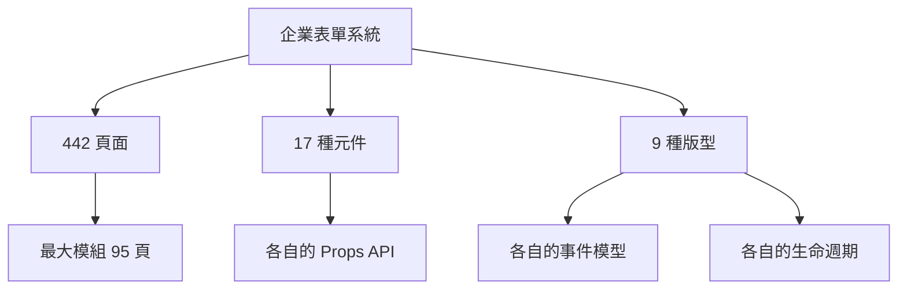

我本來以為，把 AI 指向一個企業級前端系統的 codebase，它就能寫出正確的頁面。

畢竟，這些頁面高度重複——同樣的版型、同樣的元件、同樣的事件流程。對人類開發者來說是枯燥的體力活，對 AI 來說應該是完美的任務。

我錯了。而且錯得很徹底。

## 一個不小的系統

先說說這個系統的規模。這是一個企業表單系統的前端專案：

- **442 個頁面**——分散在十幾個業務模組中，最大的模組有 95 個頁面
- **17 種 UI 元件**——從基礎的下拉選單到複雜的表格元件
- **9 種版型**——Master Layout、Master-Detail Layout、Query Layout、Report Layout……每種版型有自己的事件模型和生命週期

這些頁面遵循高度一致的模式。一個典型的表單頁面：選一個版型、配置欄位定義陣列、接上事件處理器、設定遠端查詢事件。聽起來很機械，很適合自動化。

## 72 分的現實

Day 0，我做了一件事：直接讓 AI 在沒有任何結構化指引的情況下，生成一個發票管理頁面。

用的是 GitHub Copilot Agent Mode 搭配 Claude Sonnet 4.5。我給了它完整的 codebase access，告訴它要做什麼，然後等它交卷。

結果出來了。569 行程式碼。看起來像那麼回事。

然後我逐行比對，打了 72 分。

72 分是什麼概念？不算差——基本結構對了，元件也選對了，大部分欄位配置正確。但三個嚴重幻覺讓這份程式碼無法直接使用：

**幻覺一：事件用途誤解。** 系統裡有一種遠端查詢事件，它有兩種完全不同的用途——一種是從後端拉取資料更新下拉選單的選項，另一種是真的在查詢資料。AI 搞混了。它把一個用來更新下拉選單的事件當成了資料查詢，整個資料流因此斷裂。

**幻覺二：連動邏輯缺失。** 規格書上寫「發票種類欄位」，看起來就是一個下拉選單。但在這個系統裡，選擇發票種類之後，必須觸發遠端查詢去更新「開立區分」下拉選單的選項。這條隱含的連動關係，規格書不會寫、codebase 裡要看好幾個檔案才能拼出全貌。AI 跳過了。

**幻覺三：自創事件。** AI 使用了一個叫 `deleting` 的事件處理器。問題是——這個系統裡根本沒有 `deleting` 這個事件。AI 從通用的命名規律自行推導，發明了一個不存在的 API。

這三種幻覺有一個共通點：**它們看起來都很合理。**

如果你不熟悉這個系統，你會覺得 AI 的實作邏輯清晰、命名合理、結構完整。只有深入了解系統慣例的人，才能發現這些「看似正確的錯誤」。

## 為什麼 Prompt Engineering 到這裡就失效了

第一反應是加更多 prompt。告訴 AI「不要自創事件」、「注意遠端查詢有兩種用途」、「欄位之間可能有連動關係」。

做了。有效——這三個問題確實被修正了。但新的問題又出來了。

442 個頁面、17 種元件、9 種版型的排列組合，意味著需要記住的規則數量遠超任何單一 prompt 能承載的範圍。今天修了遠端查詢的用途誤解，明天又在另一種版型上碰到事件模型的混淆。堵住一個洞，另一邊又漏水。

問題的根源不在 AI 的能力。Claude Sonnet 4.5 夠聰明，它的推理能力足以處理這些邏輯。問題在於：**它缺乏結構化的任務指引。**

想像一下，你新進一家公司，主管扔給你 442 個頁面的 codebase 說「照著寫」。你會怎麼做？你會問同事：「這個事件是做什麼的？」「那個元件有什麼坑？」「這種版型的標準流程是什麼？」

AI 沒有同事可以問。它只能從 codebase 裡自己推論——而推論會出錯，尤其是在慣例和隱含規則的地方。

## 從觀察到框架

Day 0 的 MVP 測試之後，我用 TDD 的思維重新審視了整個情境。

不急著寫任何指引。先花時間記錄 AI 在無指引下的「自然行為」——它會在哪裡犯錯？錯誤可以分成幾類？哪些錯誤最致命？

歸納出 6 類預期失敗點：

1. **Props 編造**——使用不存在的元件屬性
2. **版型混淆**——套用錯誤版型的事件模型
3. **命名自創**——發明不符慣例的變數名
4. **事件遺漏**——跳過隱含的遠端查詢流程
5. **風格偏離**——不符既有 codebase 的寫作慣例
6. **過度推論**——從模糊規格書猜測實作細節

每一類失敗，都不是 AI 「笨」。是它缺乏某一塊知識，而這塊知識無法從 codebase 的原始碼直接推導出來。

這就是框架的起點。

我規劃了 7 個 Skills 的優先順序，從最核心的頁面開發指引開始，逐步擴展到元件使用、版型選擇、API 模式。每個 Skill 針對一類失敗點，用結構化的格式告訴 AI：這裡有什麼坑、正確做法是什麼、什麼是絕對禁止的。

接下來的 22 個活躍開發日裡，這 7 個 Skills 擴展成了 14 個。184 個以上的 commits，200 多個 Claude Code sessions。框架從最初的簡單指引，演化成了一套有分層載入、有行為閘門、有回歸測試、有系統治理的完整體系。

## 這個系列要講什麼

這 13 篇文章，記錄的就是這段演化過程中的設計決策與教訓。

不是教你怎麼一步步建一個 Skills 框架的操作指南。而是一連串「我原本以為 X，結果發現 Y，最後改成 Z」的真實故事。每個設計決策背後，都有一個踩過的坑。

**基礎設計層**——怎麼用 TDD 驅動 Skill 的設計？怎麼控制 AI 的認知負荷？知識該放在 Skill 裡還是外部文件？

**行為控制層**——怎麼設計 AI 無法繞過的行為閘門？怎麼用會話分離對抗上下文幻覺？14 個 Skills 怎麼路由？

**品質保證層**——怎麼把模糊的規格書翻譯成精確的指令？怎麼診斷問題的根因？怎麼做 Skills 的回歸測試？

**生態系治理層**——14 個 Skills 長大之後怎麼做系統性治理？怎麼從個人工具變成團隊基建？

如果你正在用 AI 輔助開發，而且開始覺得「prompt 不太夠用了」——這個系列或許能給你一些方向。

---

> **本文是「打造 AI Agent Skills 框架」系列的第 1/13 篇**
>
> → 下一篇：[TDD for Documentation](/blog/ai-skills-02-tdd-for-docs)
>
> [📚 回到系列目錄](/blog/ai-skills-00-index)
