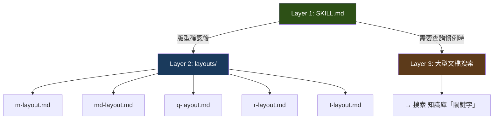

上一篇提到，Master Layout 的 Skill 膨脹到 643 行後，AI 讀到後半段時前半段的規則已經模糊。

這不是 AI 的問題。這是資訊架構的問題。

一個人類新人報到，你不會在第一天把所有文件一次丟給他。你會先給他一份入門指南，等他開始做具體任務時，再指向需要的參考資料。AI 也一樣——它的上下文窗口是有限資源，塞太多反而降低品質。

## 三次演化

### v1：所有東西塞在一起

最早的 Skill 是單一檔案。版型識別規則、事件系統規格、元件 Props 列表、完整範例——全部在一個 SKILL.md 裡。

邏輯很直覺：「AI 需要什麼就寫什麼，寫在一起最方便。」

結果是 643 行的怪物。AI 在處理到第 400 行的事件規格時，已經對前 100 行的版型選擇規則印象模糊。更糟的是，不同版型的規則互相干擾——Master Layout 的事件模型和 Query Layout 的事件模型混在同一份文件裡，AI 偶爾會把規則搞混。

### v2：拆了，但 AI 不知道什麼時候該讀哪個

意識到問題後，我把 643 行的 SKILL.md 拆成主檔案和子檔案：

- 主檔案：302 行，保留決策樹和關鍵注意事項
- 事件子檔案：377 行，事件系統的完整規格
- 範例子檔案：403 行，可參考的完整頁面

精簡了 53%，但新問題來了。AI 不知道什麼時候該載入哪個子檔案。有時候它需要事件規格卻沒去讀，有時候它把所有子檔案一口氣全讀了——回到了資訊過載的老問題。

拆檔案只解決了物理上的分離，沒有解決**認知上的引導**。

### v3：三層載入架構

第三版才真正解決了問題。關鍵不是「怎麼拆」，而是「什麼時候讀什麼」——在 Skill 裡明確寫出載入的時機和條件。



**Layer 1：SKILL.md（決策入口）**

AI 一開始只讀這一層。內容是快速參考表和決策樹——版型怎麼選、流程有幾個步驟、哪些東西絕對不能漏。控制在 300 行以內。

**Layer 2：按需載入子檔案**

當 AI 確認了版型之後，才載入對應的版型規格。不是全部載入——選了 Master Layout 就只讀 `m-layout.md`，不需要去看 Query Layout 的規格。

這一層用明確的條件觸發：「確認版型後，必須讀取對應的 layout 規格檔。」不是建議，是指令。

**Layer 3：跨 Skill 精準搜索**

遇到需要查詢的慣例或規則，不整份讀大型文檔，而是用 grep 精準定位到特定章節。

為什麼不整份讀？因為前端知識庫有 3,000 多行。全部塞進上下文窗口，其中 90% 是當前任務用不到的。

## 統一引用語法

Layer 3 的精準搜索，需要一個統一的語法。

最終的格式是：

```
→ 搜索 前端知識庫「Controller 命名規則」
→ 搜索 common-patterns.md「驗證策略」
```

為什麼不用行號引用？因為行號是脆弱的。任何一次編輯都會讓行號失效。改用章節標題作為錨點，只要文件結構穩定，引用就不會壞。

為什麼不用檔案路徑 + 全文讀取？因為那會把整份文件拉進上下文。用搜索引導 AI 只取回需要的段落，是 token 經濟學的考量。

每個引用指向一個 `##` 或 `###` 層級的章節標題。寫 Docs 的時候，章節標題就要設計成可 grep 搜索的唯一匹配——這是一個經常被忽略的細節。

## Gotchas Only 原則

三層架構解決了「什麼時候讀什麼」的問題。但 Layer 1 本身還是有膨脹的趨勢——每次發現新的注意事項，就想往 SKILL.md 裡加。

一段時間後，4 個 Skill 超過了行數預算。

回頭審視這些超標的內容，發現一個規律：很多段落在解釋「正確做法是什麼」。但 AI 不需要你教它正確做法——它的推理能力足以從範例和文件中推導。AI 真正需要的是：**哪裡有坑。**

這就是「Gotchas Only」原則：

- SKILL.md 只放「坑點」——與直覺相反的行為差異、容易搞混的 API、常見的錯誤假設
- 每個坑點用 1-2 行描述差異，不解釋完整做法
- 完整說明外部化到 Docs，需要時再搜索

舉個例子。元件的一個屬性，AI 直覺會用 `onChange` 作為主要回呼——因為這是 React 生態系的慣例。但在這個系統裡，主要回呼是 `setValue`。

Gotcha 版本只需要一行：「`setValue` 是主要回呼，不是 `onChange`」。不需要解釋 `setValue` 的完整 API——AI 會自己去查。

套用這個原則後，那 4 個超標 Skill 都回到了預算內。

## 延伸案例：沒有截圖怎麼排版？

漸進式披露的思維不只用在程式碼開發的 Skill 上。

有一個 Styling Skill 面對一個棘手的問題：AI 看不到畫面截圖，但需要正確排列表單欄位的 grid 佈局。一個面板上有 6 個欄位，每個欄位該佔多寬？兩個一排還是三個一排？

如果把所有排版規則都寫在 Skill 裡，又會膨脹。漸進式披露的做法是：在 Skill 裡放一個三步推論流程，細節規則放在獨立的 patterns-and-intent 文件裡。

三步推論：

1. **欄位分類**——根據資料型態長度，判斷全中欄位、全短欄位、還是混合
2. **資料型態映射**——文字(4-6 字) 佔 2 格、文字(7-20 字) 佔 4 格、日期佔 4 格
3. **驗證總和**——每行的 grid span 總和必須等於 12

AI 不需要背下所有映射規則。它只需要知道有三步流程，然後去查 patterns-and-intent 文件裡的映射表。

這個設計的巧妙之處在於：**用規則取代直覺。** 人類設計師看一眼截圖就知道欄位怎麼排，但 AI 沒有這種直覺。漸進式披露讓 AI 可以用結構化的步驟抵達同樣的結論。

## 設計你自己的分層

如果你要設計 AI 的知識架構，三個問題值得先想清楚：

**一、AI 一開始需要什麼？** 通常是決策樹和關鍵約束——幫它決定接下來要做什麼、哪些路是絕對不能走的。這些放在 Layer 1。

**二、什麼資訊跟「當前任務」強綁定？** 選了 A 版型就不需要看 B 版型的規格。這種條件式的資訊放在 Layer 2，用明確的觸發條件控制載入。

**三、什麼資訊是「偶爾查一下」的？** 命名規則、API 格式、完整的 Props 表——這些是參考資料，用搜索取代全文載入。放在 Layer 3。

行數不是硬性限制，但可以當作一個指標。如果 Layer 1 超過 500 行，大概有東西可以往下推。如果某個段落拿掉之後，AI 靠 grep 就能找到等效資訊——那它就應該被外部化。

---

> **本文是「打造 AI Agent Skills 框架」系列的第 3/13 篇**
>
> ← 上一篇：[TDD for Documentation](/blog/ai-skills-02-tdd-for-docs)
> → 下一篇：[Skills vs Docs 職責分離](/blog/ai-skills-04-skills-vs-docs)
>
> [📚 回到系列目錄](/blog/ai-skills-00-index)
