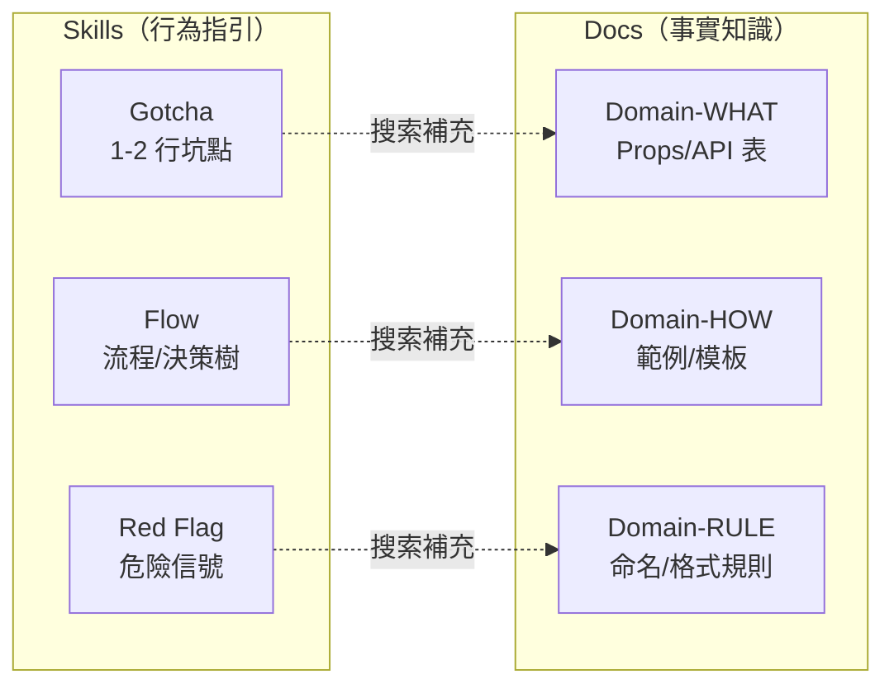

一個 DropDown 元件的 Props 修正，牽動了整個框架的知識架構。

## 一次修正，暴露全域問題

開發進行到第五天，我在回歸測試中發現一個元件的 Props 寫錯了。DropDown 的資料格式應該是 `{KEY, DESC}`，但 Skill 裡寫的是 `{KEY, VALUE}`。

簡單修正？改一行就好。

問題是這個 Props 同時被寫在三個不同的 Skill 裡。改了一個，另外兩個還是錯的。

更糟的是，這不是唯一的不一致。全面檢查之後，6 個元件的 Props 都有問題：

- Input 元件：`floatingPoints` 實際上叫 `floatingPoint`，`isError` 實際上叫 `error`
- DatePicker：Skill 裡寫 `minDate/maxDate`，實際 API 是 `min/max`
- 表格元件：Skill 裡寫 `headerName`，實際是 `header`
- 按鈕元件：回呼參數結構完全寫反了

每個 Skill 各自維護一份元件 Props 資料，誰也不知道誰的版本才是正確的。AI 拿到矛盾的指令，自然產生幻覺。

這一刻我意識到：**問題不在 Props 寫錯，而在知識放錯了地方。**

## Phase 1：什麼都塞進 Skill

最初的設計，Skill 裡放了所有 AI 可能需要的東西。元件 Props 表、事件清單、命名規則、完整範例——一站式服務。

邏輯是「AI 需要什麼就給什麼，放在它最容易找到的地方」。

但「最容易找到」和「最容易維護」是兩回事。當同一份 Props 表出現在多個 Skill 裡，Single Source of Truth 就不存在了。每次 Props 有異動，你必須搜尋所有 Skill 逐一更新——而你一定會漏。

## 快速判定規則

修完那次 Props 之後，我花了一天做了一件事：把每個 Skill 裡的每個段落問一個問題——

> 拿掉這段之後，AI 只靠 grep 搜索外部文件，能不能得到等效的資訊？

如果答案是「能」，這段就該外部化。

這個判定規則出奇地有效。它一刀切開了兩種知識：

**留在 Skill 裡的**——AI 無法從文件中自行推導的東西。是坑點、是流程、是警告。

**外部化到 Docs 的**——客觀事實。是 Props 表、是程式碼範例、是命名規則。

## 兩種知識的具體分類

抽象地說「坑點 vs 事實」太模糊。實際操作上，分成這六個類別：

**Gotcha（坑點）**：與直覺相反的行為差異。

例如：「DropDown 的資料格式是 `{KEY, DESC}` 不是 `{KEY, VALUE}`」。一行。AI 看到這行就不會搞錯，需要完整的 API 定義時再去搜索 Docs。

**Flow（流程）**：多步驟的決策流程或工作流。

例如：連動下拉選單的實作流程——先定義遠端查詢函式、再觸發遠端查詢、再設定選項資料、再清空欄位值。這是一個有順序的操作流程，AI 需要知道「先做什麼後做什麼」。

**Red Flag（危險信號）**：一行警告，提醒 AI 某個念頭是危險的。

例如：「規格書沒寫不代表不需要——問使用者」。AI 傾向把模糊資訊當成「不需要」來處理，一行 Red Flag 就能打斷這個傾向。

對應地，Docs 裡放的是：

- **Domain-WHAT**：完整的元件 Props 表（欄位定義陣列有 18 個以上的屬性）、事件清單、API 簽章
- **Domain-HOW**：完整的程式碼範例和實作模板
- **Domain-RULE**：超過 2 行的規則詳述（命名規則、格式規則）

## 雙向引用

把知識拆到兩個地方之後，需要確保 AI 能在兩者之間順暢跳轉。

**Skills → Docs（正向引用）**：

Skill 裡的 Gotcha 或 Flow 描述會附帶一個搜索指引——「更多細節，搜索知識庫的某個章節」。用上一篇提到的統一引用語法。

**Docs → Skills（反向引用）**：

Docs 裡的參考資料也會標記「這份資料被哪個 Skill 引用」。這不是給 AI 看的——是給維護者看的。下次更新這份 Docs 時，你知道哪些 Skill 可能受影響。

雙向引用是手動維護的，確實有負擔。但比起「同一份 Props 表散落在五個 Skill 裡」的維護地獄，集中管理一份 Docs + 雙向引用已經好太多了。

## 重構的實際效果

套用職責分離之後，最直接的改善是 Skill 的體積。

元件使用指引的 Skill 從 501 行降到 248 行——減少了 50%。拿掉的 253 行全部是 Props 表和詳細規則，搬到了前端知識庫裡集中管理。

同時清點了所有 Docs 的缺口——哪些知識被 Skill 引用了但 Docs 裡還沒有。列了一份清單，花了幾天逐一補齊。最終前端知識庫成長到 3,294 行、40 多個章節，覆蓋了框架裡所有需要集中管理的事實知識。

更重要的改善是**一致性**。從此，元件的 Props 只有一個版本。AI 從 Skill 的 Gotcha 知道「這裡有坑」，然後去 Docs 查完整的 Props 定義——永遠是最新的、唯一的版本。

## 怎麼判斷你的知識放錯了地方

三個信號：

**信號一：同一段內容出現在兩個以上的 Skill 裡。** 這幾乎一定要外部化。

**信號二：Skill 裡有大段的表格或清單。** 表格是事實知識的典型載體，通常屬於 Docs。

**信號三：修改一個 Skill 的某段內容後，另一個 Skill 的行為退化了。** 這代表兩個 Skill 共用了知識，但各自維護不同版本。

如果你正在建 AI Skills 框架，遇到「這段資料該放哪裡」的猶豫，用那個快速判定規則：拿掉它之後，AI 靠搜索能不能得到等效資訊？

能，就外部化。不能，就留著。

---

> **本文是「打造 AI Agent Skills 框架」系列的第 4/13 篇**
>
> ← 上一篇：[漸進式披露](/blog/ai-skills-03-progressive-disclosure)
> → 下一篇：[HARD-GATE](/blog/ai-skills-05-hard-gate)
>
> [📚 回到系列目錄](/blog/ai-skills-00-index)
