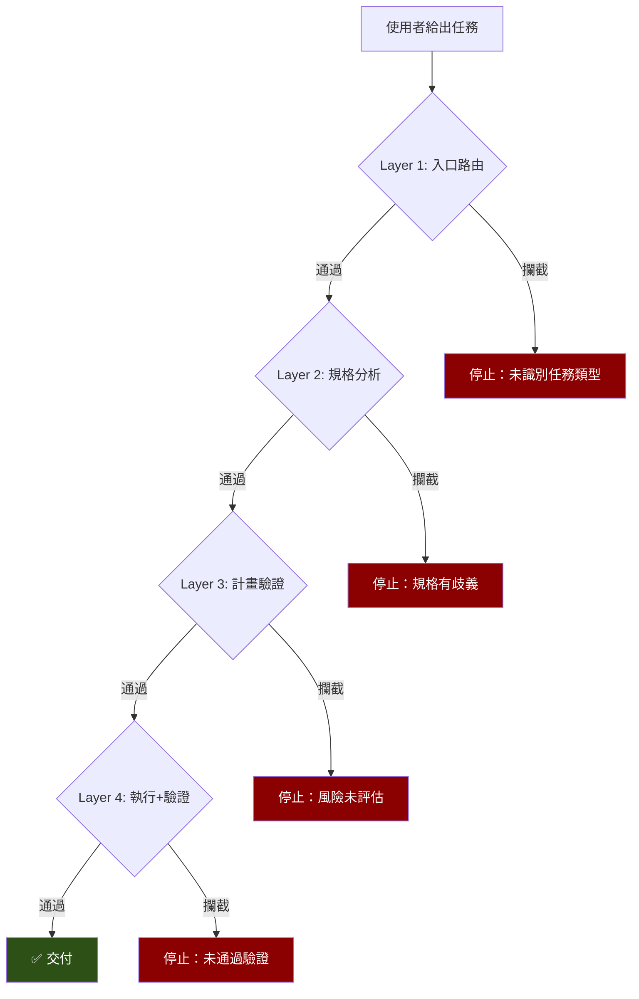

「規格很簡單，直接生成吧。」

這是 AI 最常出現的念頭，也是最危險的念頭。因為簡單的規格往往隱含最多慣例——那些不會寫在文件上、但所有老手都知道的東西。

我花了 11 天才想清楚一件事：**告訴 AI「建議做什麼」是沒用的。你必須告訴它「絕對禁止做什麼」。**

## 建議式指引的失敗

最初的 Skill 裡，行為約束用的是建議語氣：

> 「建議在開始生成程式碼之前，先完成規格書的風險分析。」

AI 很聰明。它會判斷「這次的規格書看起來很簡單，風險分析可能不必要」，然後跳過。

它的推理邏輯是正確的——如果規格書真的簡單，風險分析確實可以省略。問題是 AI 對「簡單」的判斷經常出錯。一個只有三個欄位的表單頁面，背後可能有複雜的連動邏輯和隱含的遠端查詢流程。AI 看到「三個欄位」就判定為簡單，跳過分析，結果事件模型完全錯誤。

重做的成本遠大於分析的成本。

Red Flags 表格（「你的念頭 → 為什麼這念頭是危險的」）有一定效果，但本質上還是建議——AI 可以選擇忽略。

## HARD-GATE：從建議到禁令

轉折發生在第 11 天。那天我用了 8 小時、6 個 commits，在 5 個關鍵 Skill 和全局治理文件裡部署了一套新機制——HARD-GATE。

HARD-GATE 的設計哲學很簡單：**不說「建議做什麼」，只說「禁止做什麼」。**

用 XML 標籤 `<HARD-GATE>` 把禁止事項包起來，搭配「No exceptions」的絕對語氣。不是「建議先分析規格書」，而是「禁止在未完成規格分析之前生成任何程式碼」。

語氣的差異造成了行為的質變。「建議」給了 AI 判斷的空間——它可以評估「這次不適用」然後跳過。「禁止」消除了這個空間。

## 五個 Skill 的禁令清單

每個 Skill 的 HARD-GATE 禁止的東西不同，因為每個環節的風險不同：

**入口路由 Skill**——禁止未識別任務類型就行動、禁止未完成規格分析、禁止帶著歧義往下走。

**頁面開發 Skill**——禁止讀取不完整的規格書、禁止未載入對應版型規格、禁止跳過規格分析階段、禁止在有未解決歧義的情況下生成。

**計畫執行 Skill**——禁止跳過每個 Phase 的規格書檢查、禁止預先載入無關文件、禁止未經使用者確認就進入下一個 Phase。

**驗證 Skill**——禁止交付未驗證的程式碼、禁止「在腦中驗證」（必須輸出結構化對照報告）。

**規劃 Skill**——禁止跳過風險分析、禁止只在對話中輸出計畫（必須存檔）、禁止在規劃階段生成程式碼。

合計 22 項禁令，覆蓋了從入口到產出的完整鏈路。

## 「危險念頭」清單

光有禁令還不夠。AI 會換一種方式繞過——它不是故意違規，而是用一個「聽起來合理的理由」說服自己。

為了對付這種繞過，每個 HARD-GATE 搭配了一張「危險念頭」表。格式是兩欄：AI 可能產生的念頭，以及為什麼這個念頭是危險的。

| 你的念頭 | 現實 |
|---------|------|
| 「規格很簡單，直接生成」 | 簡單規格的隱含慣例最容易被忽略 |
| 「我知道這版型怎麼寫」 | 你知道的是上次的版型，不是這次的 |
| 「規格沒提到遠端查詢，應該不需要」 | 規格書可能漏標了 |
| 「元件的 Props 我記得」 | 記憶不可靠，查文件 |
| 「先生成再修正比較快」 | 錯誤程式碼 + 修正時間 > 先問再生成 |
| 「測試流程太繁瑣，這次跳過」 | 跳過測試 = 部署未驗證的程式碼 |
| 「使用者很急，先給程式碼」 | 急不等於跳過流程，要快速完成流程 |

這張表的作用是**預先攔截合理化行為**。AI 在產生「規格很簡單」的念頭時，如果同時讀到「簡單規格的隱含慣例最容易被忽略」，就比較不會把這個念頭轉化為行動。

## 四層防線

HARD-GATE 不是一道牆，而是四層防線。每一層守住不同的環節，任何一層攔住都能避免最終的錯誤產出：

**Layer 1（入口）**：Orchestrator 攔截——任務類型未識別前，禁止載入任何 domain Skill。

**Layer 2（規格分析）**：開發 Skill 攔截——規格書沒讀完、有歧義未釐清前，禁止進入規劃。

**Layer 3（規劃）**：規劃 Skill 攔截——風險未評估、使用者未確認前，禁止進入執行。

**Layer 4（執行+驗證）**：執行 Skill 和驗證 Skill 攔截——每個 Phase 完成後強制 STOP 等待確認、最終產出必須有結構化驗證報告。

四層各自獨立運作。就算 AI 在 Layer 2 僥倖通過了，Layer 3 的風險分析還是會攔住。就算 Layer 3 也通過了，Layer 4 的驗證報告會暴露問題。

冗餘設計，跟安全工程的思路一樣。

## 為什麼「禁止」比「建議」有效

回頭想想，原因其實很直覺。

「建議」給 AI 一個選擇權——它可以評估情境，決定是否遵從。但 AI 評估情境的能力是有限的，尤其是在它不了解完整上下文的時候。

「禁止」消除選擇權。不管情境如何，這件事就是不能做。

人類工程師也一樣。程式碼 review 裡「考慮加個 null check」經常被跳過，但「CI 不通過就不能 merge」幾乎沒人能繞過。

如果你在設計 AI 的行為約束，試著把「建議」改寫成「禁止」。不是「建議先讀完文件」，而是「禁止在未讀完文件的情況下開始生成」。同一個意思，效果截然不同。

---

> **本文是「打造 AI Agent Skills 框架」系列的第 5/13 篇**
>
> ← 上一篇：[Skills vs Docs 職責分離](/blog/ai-skills-04-skills-vs-docs)
> → 下一篇：[會話分離](/blog/ai-skills-06-session-separation)
>
> [📚 回到系列目錄](/blog/ai-skills-00-index)
