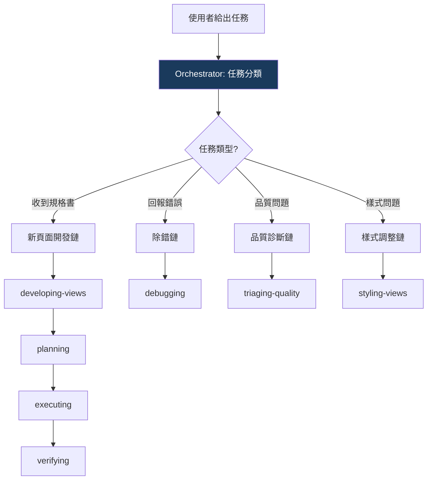

14 個 Skills。AI 收到一個任務，它怎麼知道該用哪些？

最初的答案是「讓每個 Skill 自己描述觸發條件」。結果 AI 經常選錯——明明需要先規劃再執行，它直接跳到執行 Skill；明明是品質診斷的問題，它載入了開發 Skill 想重新生成。

Skills 越多，選錯的機率越高。到了 14 個的規模，AI 在 Skill 選擇上的失誤已經成為品質問題的主要來源之一。

## 隱式路由的失敗

隱式路由的思路是：每個 Skill 在開頭描述自己的適用場景，AI 根據任務內容自行判斷。

聽起來很合理。問題出在幾個地方：

**第一，Skill 之間的邊界模糊。** 「收到規格書」這個信號，開發 Skill 和規劃 Skill 都會響應。哪個先？AI 傾向選擇「能直接產出程式碼」的那個——因為那看起來更「有進展」。但正確的做法是先規劃。

**第二，多 Skill 鏈的順序。** 一個新頁面開發任務需要載入 4-5 個 Skill，而且有嚴格的先後順序。隱式路由下，AI 可能同時載入一堆 Skill，或者用錯誤的順序。

**第三，跨窗口失效。** 上一篇提到的三窗口模式，切到新窗口後，Skill 的上下文不會自動帶過來。AI 在新窗口裡重新判斷要載入什麼 Skill，經常判斷錯誤。

## 集中路由器

解法是一個 meta-skill：Orchestrator。它是所有任務的入口，負責「先分類，再派發」。

Orchestrator 自己不做任何 domain 工作。它只做三件事：

1. **識別任務類型**
2. **派發對應的 Skill 鏈**
3. **在 Skill 鏈之間維護順序**

## 路由表

核心是一張路由表。任務信號 → 必載 Skill 鏈 → 強制流程：

| 任務信號 | 類型 | 必載 Skill 鏈 | 強制流程 |
|---------|------|-------------|---------|
| 收到規格書（PDF/Word） | 新頁面開發 | 開發 → 規劃 → 執行 → 驗證 | 規格分析 → 計畫 → Phase 執行 → 驗證 |
| 回報錯誤或異常 | 除錯 | 除錯 Skill | 診斷 → 修正 → 驗證 |
| 生成品質有問題 | 品質診斷 | 品質診斷 Skill | 五層根因分析 → 雙重修正 |
| 樣式/佈局問題 | 樣式調整 | 樣式 Skill | 意圖分析 → 套用 |

每條路徑是固定的。AI 不需要判斷「接下來該用哪個 Skill」——路由表已經定義好了。

## Orchestrator 的 HARD-GATE

Orchestrator 本身也有 HARD-GATE——而且是最嚴格的。

為什麼？因為它是第一道防線。如果在入口就走錯路，後面的所有 Skill 都會白費。

核心禁令：**禁止在未識別任務類型的情況下，載入任何 domain Skill。**

聽起來理所當然？但 AI 經常這麼做。它收到一個規格書，直覺就想載入開發 Skill 開始分析。Orchestrator 的 HARD-GATE 攔住這個衝動：先識別這是「新頁面開發」任務，然後按路由表派發完整的 Skill 鏈。

## 15 條危險念頭

Orchestrator 的 Red Flags 表是所有 Skill 裡最長的。因為入口 Skill 需要攔截的合理化行為最多。

精選幾條：

| 你的念頭 | 現實 |
|---------|------|
| 「規格很簡單，直接生成」 | 簡單規格的隱含慣例最容易被忽略。走完規格分析。 |
| 「我知道這版型怎麼寫」 | 你知道的是上次的版型，不是這次的。讀最新的版型規格。 |
| 「先生成再修正比較快」 | 錯誤程式碼 + 修正時間 > 先問再生成。 |
| 「測試流程太繁瑣，這次跳過」 | 跳過測試 = 部署未驗證的程式碼。 |
| 「使用者很急，先給程式碼」 | 急不等於跳過流程。快速完成流程，而不是跳過流程。 |

第五條特別精準。AI 在偵測到「使用者語氣急切」時，會傾向跳過流程直接給產出。但急的使用者需要的是「正確的產出」，不是「快速的錯誤」。

## 跨窗口路由修復

部署 Orchestrator 兩週後，一個 bug 浮現了。

使用者在 W1（規劃窗口）完成計畫後，開了 W2（執行窗口）。W2 裡的 Orchestrator 無法正確載入下游的 domain Skills——因為 W1 的 Skill 上下文不會自動帶到 W2。

修復方式：在窗口切換時，強制重新載入 Skill。W2 開啟後，Orchestrator 的第一步不是「接續 W1 的進度」，而是「重新識別任務類型 → 重新載入必要的 Skill 鏈」。計畫文件提供了足夠的上下文，讓 Orchestrator 知道這是一個「接續中的新頁面開發任務」。

這個修復暴露了一個更深層的設計問題：**Skill 的狀態不應該依賴對話窗口。** 所有需要跨窗口傳遞的狀態，都應該存在計畫文件裡——而不是存在 Skill 的記憶裡。

## 什麼時候需要 Orchestrator

不是所有 Skills 框架都需要一個 Orchestrator。

如果你的框架只有 3-4 個 Skill，AI 自行判斷可能就夠了。每個 Skill 寫清楚觸發條件，重疊度不高的話，隱式路由可以運作。

但當 Skill 數量超過 7-8 個、出現多 Skill 鏈（任務需要按順序載入多個 Skill）、或者跨窗口工作時——你需要一個集中的路由器。

判斷標準：**如果 AI 開始在「選哪個 Skill」上犯錯，就是時候了。**

---

> **本文是「打造 AI Agent Skills 框架」系列的第 7/13 篇**
>
> ← 上一篇：[會話分離](/blog/ai-skills-06-session-separation)
> → 下一篇：[規格書解碼器](/blog/ai-skills-08-spec-decoder)
>
> [📚 回到系列目錄](/blog/ai-skills-00-index)
