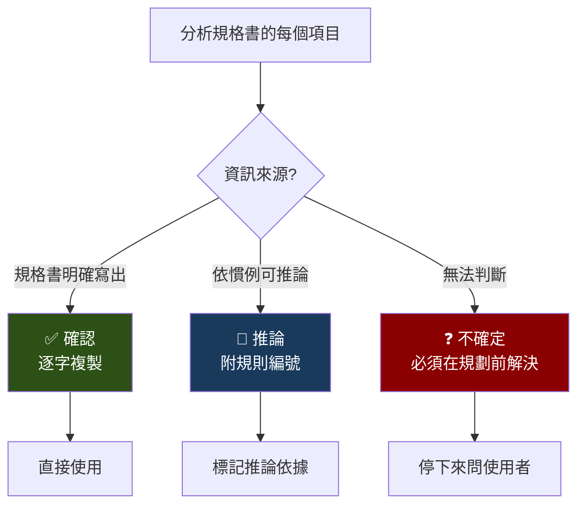

規格書寫「欄位變更時更新下拉選單」。

這句話背後是四行程式碼：定義遠端查詢函式、在欄位變更事件中觸發遠端查詢、用查詢結果設定選項資料、清空關聯欄位的值。

AI 只做了第一步。它在欄位變更事件裡寫了一行 API 呼叫，然後收工。

看起來「有做」。但選項資料沒更新、關聯欄位沒清空——功能是壞的。

這不是 AI 的推理失敗。是它不知道「更新下拉選單」在這個系統裡代表一條四步的程式碼鏈。規格書不會展開寫，因為所有老手都知道。AI 不是老手。

## 隱含慣例解碼表

解決方案很暴力：**把老手腦中的隱含知識，逐條翻譯成明確的程式碼鏈。**

我整理了 7 條核心隱含慣例。每條的格式都是「規格書這樣寫 → 實際要做這些事」：

展開兩條看看落差有多大。

**「欄位變更時更新下拉選單」**

規格書只寫這一句。但完整的實作是：
1. 定義遠端查詢函式，帶上觸發欄位的當前值
2. 在欄位的 `changed` 事件中呼叫觸發遠端查詢
3. 查詢結果透過設定選項資料寫入目標下拉選單
4. 清空目標欄位的既有值（因為選項已經變了）

四步，缺任何一步功能都是壞的。但規格書只會寫「更新下拉選單」。

**「按鈕查詢帶回資料」**

規格書寫「點擊按鈕查詢後帶回結果」。完整流程：
1. 按鈕觸發模態查詢事件
2. 模態視窗回呼後，用特定欄位判斷是哪個按鈕觸發的
3. 從回呼參數中逐一取出欄位值，寫入對應的表單欄位
4. 主檔和明細的判斷邏輯不同——主檔用精確比對，明細用字串包含判斷

四步裡的第四步，連一些資深工程師都不一定記得。

## 信心標記系統

隱含慣例解碼表解決了「已知的隱含知識」。但還有一類問題：**規格書本身不完整或模糊。**

「這個欄位需要驗證嗎？」規格書沒寫。是不需要驗證，還是撰寫規格書的人漏寫了？

AI 的預設行為是猜。猜對了是運氣，猜錯了是幻覺。

為了消滅猜測行為，我設計了三級信心標記：

**✅ 確認**：規格書明確寫出的事項。逐字複製，不做任何解讀。

**🔵 推論**：規格書沒寫，但依據系統慣例可以推論。必須附上推論依據的規則編號——「依據慣例 #3，此欄位變更應觸發遠端查詢」。

**❓ 不確定**：無法確認也無法合理推論。這一項必須在進入規劃階段之前解決——問使用者。

## 禁止推論清單

有些欄位的推論風險特別高——猜錯的成本遠大於問一個問題的成本。這些欄位被列入「禁止推論清單」：

- 遠端查詢事件的名稱
- 觸發來源的識別名稱
- 資料索引值
- 選項資料的鍵值
- 來源程式代號
- 模態查詢回呼的欄位映射

這些欄位只能是 ✅ 或 ❓。不允許 🔵。

為什麼？因為這些值是「精確匹配」的——差一個字元就會導致 API 呼叫失敗。AI 推論出的名稱「看起來對」但可能多一個底線或少一個前綴，結果是 runtime error。

## 強制輸出格式

有了信心標記，還需要確保 AI 真的用了它。

規格分析完成後，AI 必須輸出四段結構化報告。缺一段就視為分析未完成（HARD-GATE）：

**第一段：信心統計。** ✅ 幾項、🔵 幾項、❓ 幾項。一眼就能看出這份規格書有多少不確定性。

**第二段：❓ 確認表。** 逐行列出所有不確定的項目。每一項都需要使用者回答之後才能進入規劃階段。

**第三段：🔵 推論摘要。** 逐行列出所有推論項目和依據。使用者可以快速掃描，確認推論是否合理。

**第四段：資訊缺口。** 規格書缺失的項目——不是 AI 不確定，而是規格書本身沒提到但系統必須有的東西（例如驗證規則、預設值）。

這個四段結構的設計目的是**讓不確定性可見化**。

沒有這個結構之前，AI 的分析結果看起來總是「確定」的——因為它預設填滿了所有空白。使用者拿到的是一份「看起來完整」的分析，卻不知道裡面有多少是猜的。

有了信心標記和強制輸出之後，使用者一眼就能看到「有 3 項不確定、5 項是推論」。這 8 項是需要人類判斷的地方。

## 「看起來懂」vs「真的懂」

規格書解碼器的核心洞察是：**AI 處理領域文件時，「看起來懂」和「真的懂」之間有巨大的鴻溝。**

AI 會用流暢的語言總結規格書的內容，給你一種「它理解了」的錯覺。但流暢不代表正確。它能準確複述「欄位變更時更新下拉選單」，卻不知道這句話背後的四步程式碼鏈。

信心標記系統不是讓 AI 變聰明——它已經夠聰明了。信心標記是讓 AI **承認自己不確定**，而不是用猜測來填補知識缺口。

如果你的 AI 工作流涉及領域文件的解讀，問自己一個問題：AI 產出的結果裡，有多少是猜的？如果你不知道答案——你需要一個讓猜測可見化的機制。

---

> **本文是「打造 AI Agent Skills 框架」系列的第 8/13 篇**
>
> ← 上一篇：[Orchestrator](/blog/ai-skills-07-orchestrator)
> → 下一篇：[品質根因診斷](/blog/ai-skills-09-root-cause)
>
> [📚 回到系列目錄](/blog/ai-skills-00-index)
