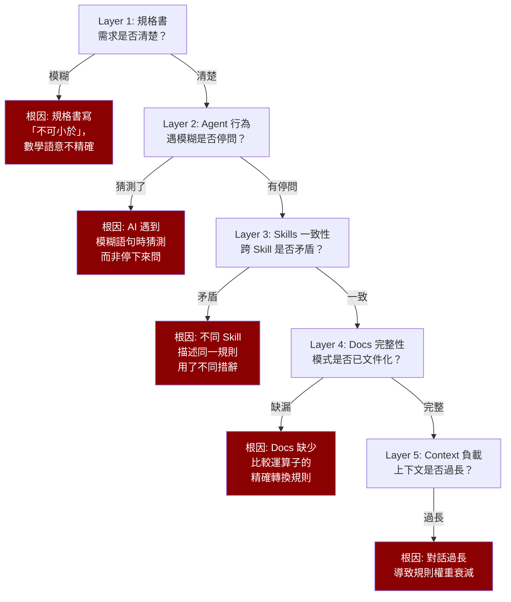

AI 生成的程式碼有一個驗證規則寫錯了。修了。

三天後，另一個頁面的同類型驗證規則又錯了。

修了。

一週後，又一個。

每次都是同一種錯誤：AI 把「不可小於」實作成「不可小於等於」。每次都只修了那一行程式碼。

第三次犯同樣的錯時，我終於問了一個早該問的問題：**程式碼的錯誤只是症狀，根因到底在哪裡？**

## 常見反應的陷阱

發現 AI 生成的程式碼有問題時，最自然的反應是：修掉那行程式碼，然後繼續。

這個反應有兩個問題。

第一，它假設問題在程式碼。但程式碼是 AI 根據 Skill 和 Docs 的指引生成的——如果指引本身有問題，修程式碼只是治標。下次遇到同類型的任務，AI 會用同樣有問題的指引，生成同樣有問題的程式碼。

第二，它假設只有一個問題。但在 Skills 框架的生態系裡，一個錯誤往往牽涉多個層級——規格書可能模糊、Skill 的指引可能遺漏、Docs 的範例可能過時。只修程式碼，等於只堵了一個洞。

## 五層根因分析

回頭追溯「不可小於」被實作成「不可小於等於」的案例。逐層檢查：

五個層級，逐層排查：

| 層級 | 檢查對象 | 這個案例的發現 |
|------|---------|-------------|
| Layer 1：規格書 | 需求是否精確表述 | 規格書寫「不可小於」——中文的數學語意不夠精確 |
| Layer 2：Agent 行為 | AI 遇到模糊是否停問 | AI 沒有停下來問，直接用自己的理解實作 |
| Layer 3：Skills 一致性 | 跨 Skill 是否矛盾 | 無矛盾 |
| Layer 4：Docs 完整性 | 比較運算子轉換規則 | Docs 裡沒有「中文描述 → 數學不等式 → 程式碼運算子」的轉換規則 |
| Layer 5：Context 負載 | 上下文是否過長 | 不適用 |

根因不在程式碼。在 Layer 1（規格書語意模糊）和 Layer 4（Docs 缺少轉換規則）。

## Dual Fix 原則

找到根因後，修復要做兩件事：

**Code Fix（立即止血）**：修正那行程式碼。`<` 改成 `<=`，或反過來——根據規格書的實際意圖。

**Ecosystem Fix（防止復發）**：
1. 在 Docs 裡新增「中文比較描述 → 數學不等式 → 程式碼運算子」的精確轉換表
2. 在驗證 Skill 的技術檢查清單裡，新增「比較運算子精確性」檢查項
3. 在規格書解碼的指引裡，把比較描述列入「必須精確確認」的項目

一個程式碼錯誤，牽動了 3 份文件的更新。如果只修了程式碼，下次遇到「不可大於」的規格描述，AI 還是會猜。

這就是 Dual Fix：**每個問題修兩處——程式碼（症狀）和生態系（根因）。**

## 6 類生態系問題

部署五層根因分析後的第一次全面診斷，一口氣發現了 6 類生態系問題。影響了 4 個 Skills 和 2 份 Docs。

**規格歧義**：規格書用自然語言描述的邏輯，有多種合理的程式碼解讀。解法不是改規格書（那是別人的文件），而是在 Skill 裡加入「遇到這類描述時，必須向使用者確認具體含義」的規則。

**Agent 猜測**：AI 遇到模糊之處，選擇猜測而非停下來問。這是行為問題——在 HARD-GATE 裡加入「禁止對模糊項目進行推論」。

**Skill 矛盾**：同一個概念在不同 Skill 裡有不同的描述。第四篇講的職責分離問題的延續——集中到 Docs，Skill 只保留引用。

**Docs 缺漏**：某些實作模式沒有被文件化。補齊。

**Context 過載**：上下文太長導致規則權重衰減。會話分離（第六篇）是解法。

**跨檔案一致性**：修了一個 Skill 的描述，另一個 Skill 引用了同一概念卻沒同步更新。

六類問題，只有第一類（規格歧義）是外部因素。其餘五類都是框架內部的問題——都是可以修的。

## HARD-GATE：禁止只修 Code

為了確保 Dual Fix 不被跳過，品質診斷 Skill 有自己的 HARD-GATE：

**禁止「只修程式碼不診斷根因」。**

AI 發現程式碼有問題後，必須先走五層根因分析，再同時做 Code Fix 和 Ecosystem Fix。不能只做其中一個。

聽起來很慢？確實比「直接改一行 code」慢。但比「改了三次同樣的錯誤」快多了。

## 5 個反模式

在實踐五層分析的過程中，歸納出 5 個常見的反模式：

**治標不治本**：只修程式碼，不追根因。下次同類問題還會出現。

**統一歸因**：把所有問題都歸因於「AI 不夠聰明」。但大多數問題的根因不在 AI，在指引系統。

**不問為何**：發現錯誤就改，不問「為什麼會錯」。快，但不持久。

**一次性修復**：修了程式碼和根因，但沒有記錄模式。下次遇到類似問題，又要從頭分析。

**壓力下跳過**：時間緊的時候跳過根因分析。但時間緊的時候犯的錯誤往往更多——更需要根因分析。

## 思維模型的轉變

品質根因診斷最大的價值不在流程本身，而在它建立的思維模型：

> **問題不在 AI，問題在指引系統。**

AI 犯錯的時候，第一反應不應該是「AI 真笨」，而應該是「哪裡的指引讓它犯了這個錯」。

這個思維轉變很重要，因為它把責任從「AI 能力」轉移到了「系統設計」。AI 的能力你控制不了——模型就是那個模型。但系統設計你控制得了——Skill 可以改、Docs 可以補、流程可以調。

每次品質問題，都是改善指引系統的機會。

---

> **本文是「打造 AI Agent Skills 框架」系列的第 9/13 篇**
>
> ← 上一篇：[規格書解碼器](/blog/ai-skills-08-spec-decoder)
> → 下一篇：[回歸測試與驗證閘門](/blog/ai-skills-10-regression-verification)
>
> [📚 回到系列目錄](/blog/ai-skills-00-index)
