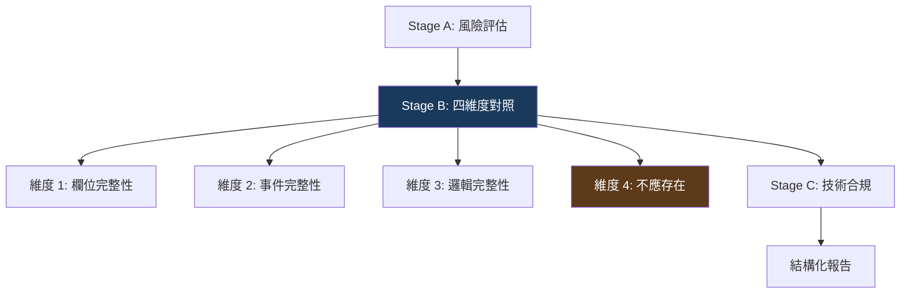

改了 Master Layout 的 Skill，Master-Detail Layout 的生成品質退化了。

原因是兩種版型共用了一段元件定義。改了 A 版型的描述方式——措辭更精確了——卻讓 AI 對同一元件在 B 版型上的理解偏移了。

一個理論上的「改善」，實際上製造了新的問題。

Skills 不是文件。它們有相依性、有副作用。需要跟程式碼一樣的品質保證機制。

## 回歸測試：四輪 Baseline 迭代

從第四天開始，我為每種版型建立了獨立的回歸測試基線。

流程很單純：用當前版本的 Skill 生成一個標準頁面，逐行人工檢查，確認品質後存檔作為 baseline。之後每次修改 Skill，重新生成同一個頁面，和 baseline 比對差異。

簡單的流程，但每一輪都暴露出意想不到的問題。

| 輪次 | 版型 | 暴露的問題 |
|------|------|-----------|
| Sub-mission 5a | Master Layout | 首次端到端驗證通過，建立初始 baseline |
| Sub-mission 5b | Master-Detail Layout | 明細架構完全需要重構——事件綁定方式和主檔/明細的鍵值關聯 |
| Sub-mission 5c | Query Layout | 11/11 驗證項全部通過 |
| Sub-mission 5d | Report Layout | 通過 |

5b 是最戲劇化的一輪。Master-Detail Layout 比 Master Layout 多了一個明細表格，帶來了一整套獨有的事件機制——新增明細的事件、明細插入後的初始化、主檔與明細的鍵值關聯。

初始 baseline 在這些地方全部出錯。不是小錯——是架構層級的錯誤。修正之後重新生成 baseline，又發現遠端查詢的回傳值存取路徑不一致。再修正，再重新生成。

Baseline 總共重新生成了 3 次。每次都因為暴露了新的、更深層的不一致。

這個迭代過程讓我意識到：**回歸測試的價值不只在「驗證修改沒壞」，更在「暴露原本就壞了但沒發現的東西」。** 每次重新生成 baseline，都是用最新的 Skill 重新審視「AI 在這種版型上的行為」。新的 Skill 改善了一些行為，同時也讓之前被掩蓋的問題浮出水面。

## 驗證閘門：四維度對照

回歸測試解決了「修改 Skill 是否有副作用」的問題。但還有另一個問題：**怎麼確保 AI 針對特定規格書的產出是正確的？**

最初的做法是：AI 生成完程式碼後，自己做一輪「自我檢查」。

結果：**平均自審發現率只有 8.8%。**

AI 自己寫的程式碼，自己檢查，幾乎找不到問題。不是因為程式碼完美——而是因為同一個上下文裡的偏見會自我強化。AI「覺得」自己寫對了，檢查的時候就傾向確認這個感覺。

解決方案是獨立的驗證 Skill，用結構化的四維度對照取代自由心證：

**維度一：欄位完整性。** 規格書的每個欄位，在程式碼裡都有對應的定義嗎？逐一比對，不是「大致有」就算通過。

**維度二：事件完整性。** 規格書要求的每個遠端查詢、每個連動邏輯，程式碼裡都有正確實作嗎？這一維是最容易出錯的——事件的名稱必須逐字比對，不是語意接近就行。

**維度三：邏輯完整性。** 驗證規則、跨欄位比較、條件判斷的運算子——「不可小於」到底是 `<` 還是 `<=`？

**維度四：不應存在。** 前三維檢查「該有的有沒有」。第四維反過來——檢查「不該有的是不是被 AI 自己加上去了」。AI 有時候會「好心」多加一些功能，而這些功能沒有規格書依據。

第四維的設計很反直覺。一般的 code review 只關心「漏了什麼」，不太關心「多了什麼」。但 AI 的特性是它會「補全」——遇到它認為應該有但規格書沒寫的功能，它可能自行添加。這些添加往往看起來合理，但沒有規格書依據的程式碼就是潛在的風險。

## 偏差比缺失更危險

四維度對照的結果用三種標記：

- ✅ **存在**：完全匹配規格書
- ❌ **缺失**：完全沒實作
- ⚠️ **偏差**：有實作，但意思不對

偏差是最危險的。

缺失容易發現——「這個欄位怎麼沒有？」一看就知道。但偏差會被「看起來有做」蒙蔽。

舉個例子：遠端查詢事件的名稱，規格書寫 `GET_LEVELSTART`，AI 生成了 `GET_LEVEL_START`。語意完全相同，但多了一個底線。在 runtime，API 呼叫會找不到對應的處理函式——沈默失敗，不會報錯。

再例如：欄位回傳值的存取路徑，正確的是 `result.rtn_Row.DL_GOODS`，AI 寫成了 `result.DL_GOODS`。兩者在某些情況下行為相同，但在另一些情況下會取到 undefined。

這類偏差在自審中幾乎不會被發現（發現率 2-5%）。需要逐字比對規格書才能抓到。

## 量化成效

部署了四維度驗證之後，量化了 before/after：

| 指標 | 自審（無驗證 Skill） | 四維度驗證 | 改善倍數 |
|------|-------------------|----------|---------|
| 明細事件鍵值缺失 | ~20% 發現率 | 100% | 5x |
| 回傳值路徑錯誤 | ~5% 發現率 | 100% | 20x |
| 名稱符號差異 | ~2% 發現率 | 100% | 50x |
| **整體平均** | **8.8%** | **97.5%** | **11x** |

最驚人的是名稱符號差異——從 2% 提升到 100%，改善 50 倍。這種「差一個字元」的錯誤，靠自審幾乎不可能發現。結構化的逐字比對才能抓到。

## HARD-GATE：「在腦中驗證」不算驗證

驗證 Skill 的 HARD-GATE 只禁止一件事：

> **禁止交付沒有結構化對照報告的程式碼。**

「我在腦中比對過了，沒問題」——不算。必須輸出一份四維度的對照報告，每個維度的每個項目都有 ✅ / ❌ / ⚠️ 標記。

這個 HARD-GATE 的設計動機來自觀察：AI 在被問「你確認過了嗎？」時，幾乎總是回答「確認過了」。但「確認過」和「輸出結構化報告」的品質差異是 8.8% vs 97.5%。

強制外部化——把「我確認了」變成「這是我的確認報告」——是消除自審偏差最有效的手段。

## 雙軌品質保證

回歸測試和驗證閘門是兩條不同的品質保證軌道：

**回歸測試**保護 Skill 本身的品質——每次修改 Skill 後，確認沒有副作用。面向的是框架開發者。

**驗證閘門**保護每次生成的產出品質——每次 AI 生成程式碼後，用結構化對照確認正確性。面向的是 Skill 使用者。

兩條軌道互相獨立。即使 Skill 經過了完整的回歸測試，特定規格書的產出仍然需要驗證——因為 Skill 保證的是「一般情況下的正確性」，而每份規格書都有自己的特殊性。

反過來也成立。即使每次產出都通過了驗證，Skill 修改後仍然需要回歸測試——因為驗證只看到當前這一份規格書的結果，看不到其他版型是否退化了。

Skills 框架的品質保證，需要兩條軌道同時運行。

---

> **本文是「打造 AI Agent Skills 框架」系列的第 10/13 篇**
>
> ← 上一篇：[品質根因診斷](/blog/ai-skills-09-root-cause)
> → 下一篇：[收斂審查](/blog/ai-skills-11-convergence-review)
>
> [📚 回到系列目錄](/blog/ai-skills-00-index)
