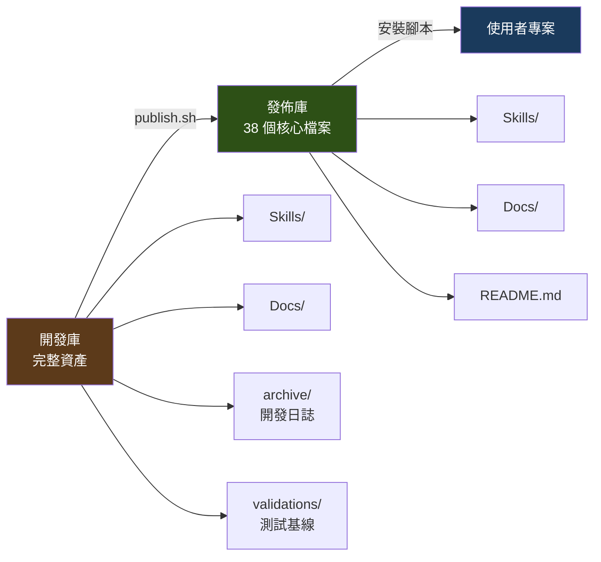

框架做好了。14 個 Skills，通過了收斂審查，回歸測試全綠。

然後第一個同事試用，5 分鐘就卡住了。

不是 Skill 有問題。是他不知道怎麼安裝。

## 安裝體驗：最容易被忽視的環節

最初的「安裝流程」是一份文字說明：「複製這些檔案到你的專案目錄，然後在 CLAUDE.md 裡加上這幾行設定。」

看起來很清楚。但實際操作時，問題一個接一個：

- 「這些檔案」是哪些？有 38 個核心檔案散在多個目錄裡
- 複製到哪個路徑？不同的 AI 工具有不同的設定路徑
- CLAUDE.md 裡要加什麼？加在哪個位置？

第一版安裝指南是從「工具開發者」的視角寫的——我知道檔案在哪、知道設定怎麼改，所以說明寫得很簡略。

改成從「使用者」的視角：從使用者的專案出發，不需要了解框架的內部結構，只需要執行幾個步驟。最終做到了腳本化安裝，100% 達成率。

## 開發庫與發佈庫的分離

框架有兩個面向：**開發者**（我自己，持續改進 Skills）和**使用者**（團隊成員，消費 Skills）。

兩者需要的東西不一樣。開發者需要完整的開發產物——測試基線、回歸報告、開發日誌、驗證腳本。使用者只需要 Skills + Docs。

如果把所有東西都推給使用者，他們的 AI 工具會讀到測試基線和開發日誌——這些東西不只沒用，還會污染上下文。

解決方案是雙庫分離：

一個發佈腳本處理這個分離。它讀取開發庫，透過 `.gitattributes` 的 `export-ignore` 標記過濾掉非核心檔案，產出一個乾淨的發佈庫。每次發佈的 commit message 帶上源開發庫的 hash，方便追溯。

## 版本偵測

雙庫分離之後，下一個問題：使用者怎麼知道自己用的是不是最新版？

答案是一個版本元資料檔案，記錄使用者本地同步的 commit hash。Orchestrator（入口路由 Skill）在啟動時自動檢查這個 hash 跟發佈庫最新版的差異。

三種狀態：
- 有新版本 → 提示使用者同步
- 已是最新 → 靜默通過
- 偵測失敗 → 跳過（不阻擋工作流程）

第三種狀態的設計是刻意的。版本偵測是「有了更好」的功能，不應該因為網路問題或其他原因阻止使用者工作。

## 2 小時工作坊

安裝搞定了，但使用者不知道怎麼用。

14 個 Skills 的框架不是自解釋的。就算 README 寫得再清楚，新使用者面對「Orchestrator 是什麼？HARD-GATE 是什麼？三窗口模式是什麼？」還是會一頭霧水。

設計了一個 2 小時的工作坊。結構：

**前 30 分鐘：概念導入。** 為什麼需要 Skills 框架？用 MVP 測試的 72 分開場——在座的每個人都有過「AI 生成的程式碼看起來對但其實不對」的經驗。框架就是為了解決這個問題。

**中間 60 分鐘：操作示範。** 從收到一份規格書開始，走完整個流程——Orchestrator 路由、規格分析、計畫撰寫、分窗口執行、四維度驗證。

其中有一個「刻意出錯」的環節。我準備了一個示範腳本，故意讓 AI 跳過規格分析直接生成程式碼。然後逐一指出生成結果裡的幻覺——讓使用者親眼看到「不走流程」的後果。

這比任何說教都有效。當你看到 AI 自信地生成了一個不存在的事件處理器，你就理解了為什麼 HARD-GATE 要禁止跳過規格分析。

**最後 30 分鐘：Q&A + 動手練習。** 每個人用自己負責的頁面試一次。

## 反饋迴路

工作坊結束後，使用者開始實際使用。問題源源不斷。

但問題不可怕。可怕的是問題沒有回到框架開發者手裡。

反饋迴路的設計有三層：

**第一層：反饋提交 Skill。** 使用者在使用過程中遇到問題，可以直接觸發這個 Skill。它會引導使用者完成一個五步流程：診斷問題類型 → 提取關鍵資訊 → 組裝 Issue 內容 → 預覽確認 → 提交到版本控制平台的 Issue 追蹤系統。

使用者不需要自己格式化 Issue——Skill 替他們做。這大幅降低了回報問題的摩擦。

**第二層：三級降級。** 如果 CLI 提交 Issue 失敗（權限問題、網路問題），自動降級為瀏覽器導向——打開 Issue 頁面，預填內容。如果瀏覽器也不行，降級為文字輸出——使用者手動複製貼上。

**第三層：回饋回流。** 收到的每個 Issue 都走品質根因診斷（第九篇的五層分析）。不是只修 bug——是修生態系。使用者的踩坑經驗，成為框架改進的養分。

## 變更同步

框架持續演進，使用者手上的版本怎麼跟上？

規格書模板是最容易出問題的地方。模板格式一改，所有依賴這個模板的 Skills 和 Docs 都可能受影響。

為了管理這個，建立了一個靜態依賴表——明確列出每個模板被哪些 Skills 和 Docs 引用。模板變更時，按照依賴表逐一檢查影響範圍。

這不是自動化的——是手動維護的依賴表。自動化偵測在文件系統裡不太可行（不像程式碼有 import 語法）。但手動維護一張表，比「靠記憶追蹤依賴」可靠得多。

## 技術框架的最後一哩路

回頭看，框架本身的設計（Skills、HARD-GATE、漸進式披露）佔了 80% 的開發時間。但團隊能不能用起來，取決於那最後 20%：

- 安裝體驗夠不夠順
- 版本更新夠不夠自動
- 新手上手夠不夠快
- 反饋回路夠不夠暢通

這四個維度，沒有一個是「技術上困難」的。但每一個都需要從使用者的角度重新思考——而不是用開發者的視角自我滿足。

---

> **本文是「打造 AI Agent Skills 框架」系列的第 12/13 篇**
>
> ← 上一篇：[收斂審查](/blog/ai-skills-11-convergence-review)
> → 下一篇：[AI Skills 框架的未解問題](/blog/ai-skills-13-outlook)
>
> [📚 回到系列目錄](/blog/ai-skills-00-index)
