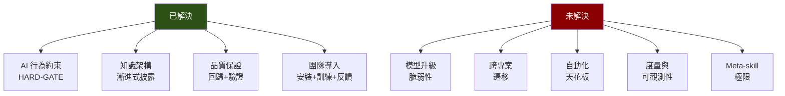

22 個活躍開發日。14 個 Skills。184 個以上的 commits。

框架做到了什麼？AI 在企業表單系統上的生成品質從 72 分的不可用狀態，提升到了回歸測試穩定通過、四維度驗證偵測率 97.5% 的可用狀態。

但有些問題，22 天是不夠回答的。

## 問題一：模型升級的脆弱性

整個框架是用 Claude Code 搭配特定版本的模型開發和測試的。Day 0 的 MVP 測試用的是 Copilot Agent Mode 搭配 Claude Sonnet 4.5。

不同的 AI 工具和模型，行為差異比預期的大。同樣的 Skill，在一個模型上效果很好的 HARD-GATE，在另一個模型上可能被「創意性地繞過」。同樣的 Red Flags 表格，一個模型會逐條檢查，另一個模型可能只掃一眼。

這帶出一個尖銳的問題：**模型升級後，Skills 是否需要全面重新驗證？**

理論上，好的 Skill 設計應該是模型無關的——它描述的是任務知識，不是針對特定模型的 hack。但實踐中，Skill 的措辭、語氣、結構都會影響不同模型的遵從度。一個在強模型上多餘的 HARD-GATE，在弱模型上可能至關重要。

目前沒有好的答案。每次模型升級，只能重跑回歸測試，觀察行為差異，逐一調整。這是一個手動的、不可規模化的流程。

## 問題二：跨專案遷移

14 個 Skills 裡，有多少設計模式是可遷移的？

**可遷移的**：HARD-GATE 的設計模式（禁止式比建議式有效）、三層漸進式披露、Skills vs Docs 的職責分離、Dual Fix 原則、信心標記系統。這些是「方法論」層級的知識，跟特定專案無關。

**不可遷移的**：隱含慣例解碼表（每個專案的慣例不同）、具體的路由表（任務類型和 Skill 鏈跟專案架構綁定）、Docs 的內容（每個 codebase 的知識不同）。

粗估 60% 的設計模式可以遷移，40% 要重新發展。

但「重新發展」不代表從零開始。TDD for Documentation 的方法論是通用的——先觀察 AI 在新專案上的失敗模式，再針對性地建 Skill。差別在於失敗模式不同，Skill 的內容不同。

真正的問題是：**有沒有辦法加速那 40% 的重新發展？** 有沒有一個 meta-framework，能自動分析新 codebase 的結構，產出初始的 Skill 骨架？

目前沒有。這可能是下一個值得探索的方向。

## 問題三：自動化的天花板

HARD-GATE 靠的是什麼？靠的是 AI 願意遵守文字指令。

`<HARD-GATE>` 標籤不是程式碼——它沒有 runtime enforcement。它只是一段 Markdown 文字。AI 遵守它，是因為它被訓練成「遵守指令」的模型。

如果 AI 不遵守呢？

在目前的模型上，HARD-GATE 的遵從率很高。但這不是保證。模型的行為是機率性的，不是確定性的。在某些邊界情況下——上下文特別長、任務特別複雜、多個 HARD-GATE 互相衝突——AI 可能會「創意性地重新解讀」禁令。

這暴露了一個根本性的限制：**Skills 框架是建立在「信任 AI 會遵守文字指令」之上的。** 如果這個前提不成立，整個框架就搖搖欲墜。

長遠來看，行為約束可能需要從「文字層面」移到「系統層面」——例如，在 AI 的輸出管道中嵌入結構化的驗證步驟，由外部系統而非 AI 自身來執行。

但目前，文字層面的 HARD-GATE 已經足夠有效。「足夠有效」不代表完美——它代表在可用的技術條件下，這是最好的方案。

## 問題四：度量與可觀測性

框架的效益怎麼量化？

目前能量化的指標：
- 回歸測試通過率（13/13）
- 四維度驗證偵測率（97.5%）
- Skill 修改後的副作用發生率

不能量化的指標：
- AI 生成程式碼的「需要人工修改」比率（沒有系統性地追蹤）
- 框架導入前後的「開發速度」差異（太多變數無法控制）
- 使用者滿意度的持續追蹤（只有工作坊後的即時反饋）

沒有好的可觀測性，就無法做資料驅動的改進。你只能靠直覺和回歸測試來判斷框架是否在變好。

一個可能的方向是：在驗證 Skill 的流程中，自動記錄每次驗證的 ✅ / ⚠️ / ❌ 分佈。隨時間累積，就能看到趨勢——某類問題是否在減少、某個 Skill 的修改是否帶來了改善。

但這需要基礎建設——目前沒有。

## 問題五：Skills 的 Skills

最後一個問題，也是最 meta 的問題：**誰來指導 AI 寫 Skills？**

14 個 Skills 都是我手動寫的。寫 Skill 需要對 codebase 的深入理解、對 AI 行為的觀察、對資訊架構的設計能力。

但 AI 輔助寫作已經是現實。有沒有一個 meta-skill，能指導 AI 來寫 Skills？

這不是幻想——這個系列的部落格文章本身就是用 AI 輔助撰寫的。從原始素材中提取數據、按照結構組織內容、檢查術語一致性——AI 都參與了。

問題是 Skills 比部落格文章更 nuanced。一個 Gotcha 的措辭如果不夠精準，AI 可能誤讀。一個 HARD-GATE 的邊界如果太寬，可能攔住正常操作；太窄，可能漏掉危險行為。這種精微的拿捏，目前還是需要人類判斷。

meta-skill 的設計是否有極限？當你用 Skill 來指導 AI 寫 Skill 來指導 AI 寫程式碼——這個遞迴是否有終止條件？

我不知道。但我懷疑答案是：**每一層遞迴都需要更少的 Skills，但每個 Skill 需要更精準的設計。**

## 誠實面對邊界

這 13 篇文章記錄的是一段旅程，不是一個終點。

22 天足以建立一個有效的框架。22 天不足以回答所有問題。

如果你也在建類似的東西，帶走方法論，但不要帶走具體的答案。你的專案有自己的失敗模式、自己的隱含慣例、自己的團隊文化。方法論是可遷移的——先觀察失敗、再設計指引、用 TDD 驗證、用 HARD-GATE 防護、用回歸測試保證。

至於那五個未解問題——如果你有好的答案，歡迎分享。

---

> **本文是「打造 AI Agent Skills 框架」系列的第 13/13 篇**
>
> ← 上一篇：[從個人工具到團隊基建](/blog/ai-skills-12-team-adoption)
>
> [📚 回到系列目錄](/blog/ai-skills-00-index)
